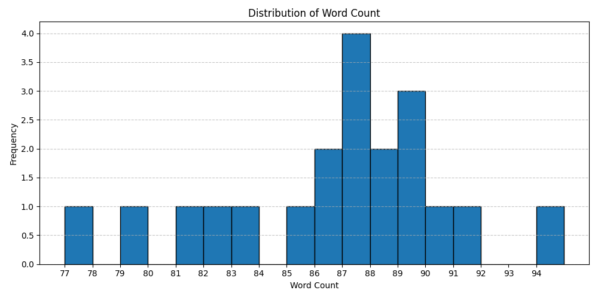
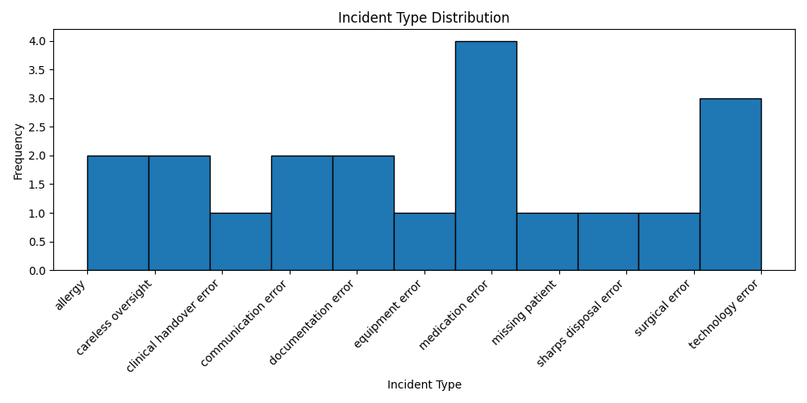
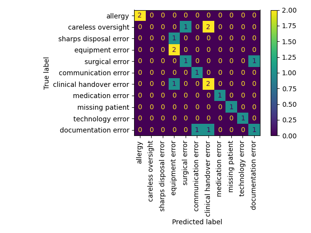
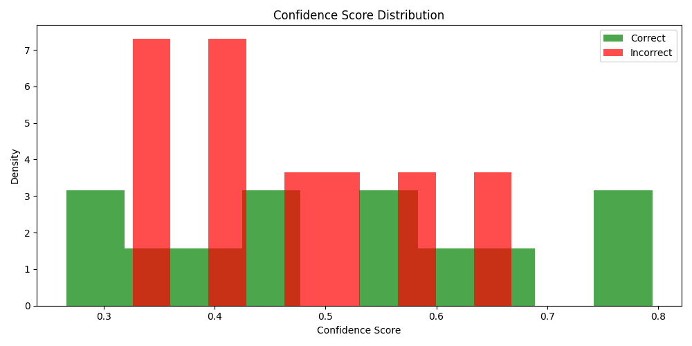
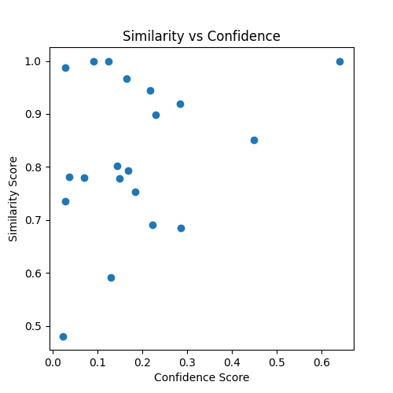

# llm-patient-safety-incidents

## About
Using open-source large language models (LLMs) to summarize patient safety incident reports with two main goals:
- extract key information about what caused the incident and
- categorize the safety issue (e.g. medication errors or patient falls).

## Dataset
The dataset contains 20 incident reports that were generated online with ChatGPT. Afterwards, incident cause and incident type labels were extracted manually.:
- allergy: any incident that induced an allergic reaction
- careless oversight: incidents in which a careless oversight in spite of correct signs in place caused harm to the patient
- clinical handover error: occurred during handover
- communication error: when there has been a misunderstanding
- documentation error
- equipment error: incorrect use of medical equipment
- medication error
- missing patient
- sharps disposal error
- surgical error
- technology error: incident occur due to breakdown in technology






## Libraries Used
- pandas
- uuid
- transformers
- matplotlib
- sklearn
- spacy

## Chosen Model Rationale
TODO: reason behind why the models were chosen

## Models and Evaluation
### [bart-large-cnn](https://huggingface.co/facebook/bart-large-cnn)
This zero-shot classifier is bart-large trained on MultiNLI dataset in which the hypothesis is "This text is about {label}". BART is a transformer model with a bidirectional encoder and autoregressive decoder - it is good for text comprehension and generation.

Below is an evaluation of the results
```
accuracy:  0.6
                         precision    recall  f1-score   support

         surgical error       1.00      1.00      1.00         2
       medication error       0.00      0.00      0.00         3
                allergy       0.00      0.00      0.00         1
    communication error       0.50      1.00      0.67         2
    documentation error       0.50      0.50      0.50         2
  sharps disposal error       0.50      1.00      0.67         1
        equipment error       0.40      0.67      0.50         3
clinical handover error       1.00      1.00      1.00         1
       technology error       1.00      1.00      1.00         1
     careless oversight       1.00      1.00      1.00         1
        missing patient       0.50      0.33      0.40         3

               accuracy                           0.60        20
              macro avg       0.58      0.68      0.61        20
           weighted avg       0.51      0.60      0.53        20
```

with confusion matrix



and the following distribution of confidence scores



TODO: conclusion of evaluation

### [roberta-base-squad2](https://huggingface.co/deepset/roberta-base-squad2)
Roberta-base-squad2 is fine-tuned on RoBERTa base using SQuAD2 dataset for extractive answer questioning. RoBERTa uses a transformer model petrained for Masked Language Modelling (MLM). Standford Question Answering Dataset (SQuAD) comprises of contexts, questions and answers crowdworked on wikipedia articles. The answers are a segment of text from the context or otherwise unanswerable (therefore meaning this model can handle unanswerable questions). This model is hallucination resistant meaning it only extracts what is given in the context.




To evaluate, I used cosine similarity of the embedding vectors between actual and predicted. The results suggests that the model may be able to extract the correct information (high similarity score between 0.7-1), but it is not very confident (low confidence scores <0.4). This is likely because the training dataset is on wikipedia articles, lacking the domain knowledge of patient safety incident reports.

## Next Steps
- larger dataset