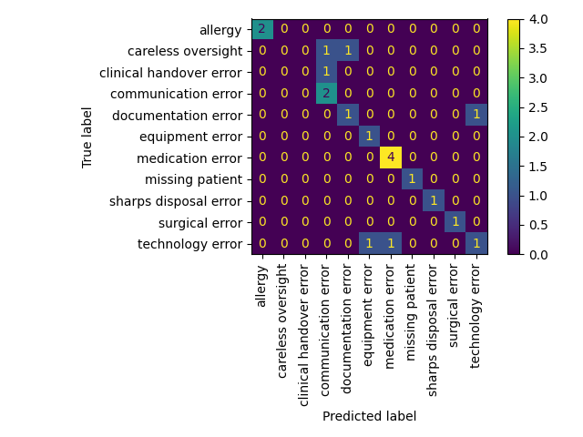
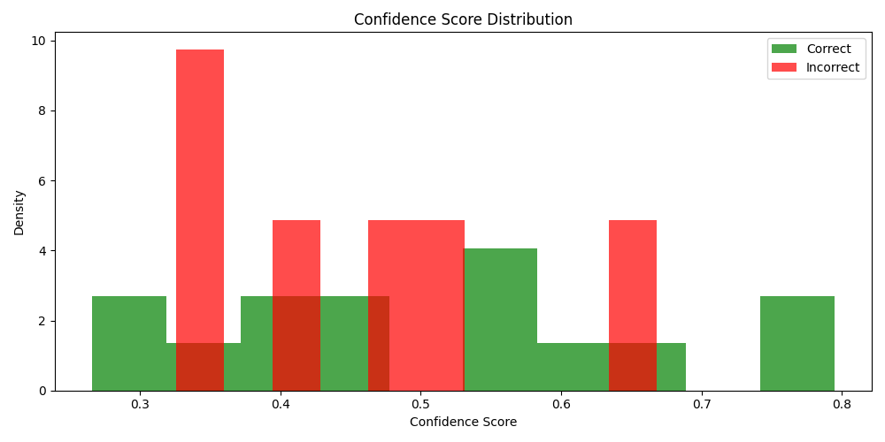

# llm-patient-safety-incidents

## About
Using open-source large language models (LLMs) to summarize patient safety incident reports with two main goals:
- categorize the safety issue (e.g. medication errors or patient falls).
- extract key information about what caused the incident and

## Libraries Used
- pandas: saving csv and loading into df
- uuid: generating unique ids
- transformers: loading hugging face models
- matplotlib: plotting
- sklearn: classification metrics
- spacy: similarity

## Limitations
For this project, I was limitted by time constraints, data and the chosen models. Because of time contraints, I couldn't test out more models and chose what appeared to be the best. The dataset of incident reports was generated by ChatGPT and manually labelled. This lead to an uneven distribution of incdent types and the dataset may not necesarily reflect real-world incident reports. The models were from Hugging Face and pretrained on public data, they have not been fine-tuned on any safety incident report data leading to low confidence scores.

## Dataset
The dataset contains 20 incident reports that were generated online with ChatGPT. Afterwards, incident cause and incident type labels were extracted manually.:
- allergy: any incident that induced an allergic reaction
- careless oversight: incidents occurred because of an accident or in spite of correct signs in place caused harm to the patient
- clinical handover error: occurred during handover
- communication error: when there has been a misunderstanding
- documentation error
- equipment error: incorrect use of medical equipment
- medication error
- missing patient
- sharps disposal error
- surgical error
- technology error: incident occur due to breakdown in technology


## Models and Evaluation
### [bart-large-cnn](https://huggingface.co/facebook/bart-large-cnn)
This zero-shot classifier is bart-large trained on MultiNLI dataset in which the hypothesis is "This text is about {label}". BART is a transformer model with a bidirectional encoder and autoregressive decoder - it is good for text comprehension and generation.

Below is an evaluation of the results
```
accuracy:  0.7
                         precision    recall  f1-score   support

                allergy       1.00      1.00      1.00         2
     careless oversight       0.00      0.00      0.00         2
clinical handover error       0.00      0.00      0.00         1
    communication error       0.50      1.00      0.67         2
    documentation error       0.50      0.50      0.50         2
        equipment error       0.50      1.00      0.67         1
       medication error       0.80      1.00      0.89         4
        missing patient       1.00      1.00      1.00         1
  sharps disposal error       1.00      1.00      1.00         1
         surgical error       1.00      1.00      1.00         1
       technology error       0.50      0.33      0.40         3

               accuracy                           0.70        20
              macro avg       0.62      0.71      0.65        20
           weighted avg       0.61      0.70      0.64        20
```

with confusion matrix




Overall, the model showed a 0.7 accuracy with perfect f1 scores (f1=0) for allergy, missing patient, sharps disposal error and surgical error.

The model showed it had limitted understanding of what labels such as `careless oversight`, `clinical handover` or `technology error` meant. Here are some examples showing this.

`Careless oversight` (f1=0) was mislabelled as `communication error` or `documentation error`:
```
An inpatient undergoing chemotherapy was mistakenly served a meal containing grapefruit
A patient in the emergency department was mistakenly catheterized despite a clear note stating no catheterization
```

`Technology error` mislabelled as `equipment error` or `medication error`:
```
1. Patient was denied their routine beta-blocker for three consecutive days due to an electronic prescription glitch.
2. During an emergency code blue response, the defibrillator failed to power on.
```
On the other hand, it correctly labelled this following incident.
```
A power outage occurred during an endoscopy procedure.
```

Finally, the diagram below highlights the models' confidence



### [roberta-base-squad2](https://huggingface.co/deepset/roberta-base-squad2)
Roberta-base-squad2 is fine-tuned on RoBERTa base using SQuAD2 dataset for extractive answer questioning. RoBERTa uses a transformer model petrained for Masked Language Modelling (MLM). Standford Question Answering Dataset (SQuAD) comprises of contexts, questions and answers crowdworked on wikipedia articles. The answers are a segment of text from the context or otherwise unanswerable (therefore meaning this model can handle unanswerable questions). This model is hallucination resistant meaning it only extracts what is given in the context.


To evaluate, I used cosine similarity of the embedding vectors between actual and predicted. The results suggests that the model may be able to extract the correct information (high similarity score between 0.7-1), but it is not very confident (low confidence scores <0.4). This is likely because the training dataset is on wikipedia articles, lacking the domain knowledge of patient safety incident reports.